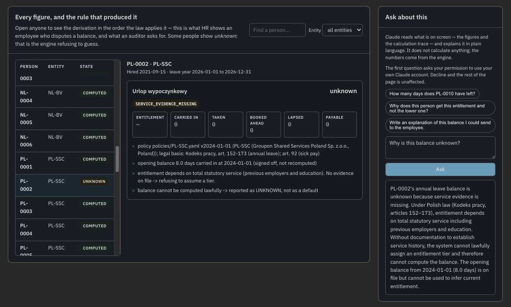

# Absence engine

[](https://github.com/krystoftulis-blip/absence-engine/actions/workflows/tests.yml)

A first working version of unified absence management across Groupon's legal
entities. One calculation engine and one data model for every entity; the rules
themselves stay local, as versioned, reviewable data.

The design decision and its justification are in **[DECISION.md](DECISION.md)**.
The rollout, communication and risk analysis are in
**[CHANGE_PLAN.md](CHANGE_PLAN.md)**. This file is how to run it.

All data in this repository is synthetic and generated by a seeded script. No
real employee data is used anywhere.

---

## Running it

Requires Python 3.9 or newer. One dependency; the test suite uses only the
standard library.

```bash
git clone <this repo>
cd absence-engine
pip install -r requirements.txt        # PyYAML

export PYTHONPATH=src                  # Windows: set PYTHONPATH=src
python -m absence registry
```

If you would rather not set an environment variable, every command also works
as `python -c "import sys; sys.path.insert(0,'src'); from absence.cli import main; main()"`,
or install the package in editable mode with `pip install -e .`.

### The commands

```bash
# The unification boundary: which entities are in the engine, which are not, why
python -m absence registry

# Balances for an entity, including the ones the engine refuses to compute
python -m absence balance --entity PL-SSC

# How one person's number was derived, rule by rule
python -m absence explain --employee PL-0001
python -m absence explain --employee PL-0002      # an UNKNOWN, and why

# The point of the whole thing: compare each entity's own file against a
# recomputation from the ledger, and say where they disagree and probably why
python -m absence reconcile --html --csv

# What has to change for next year, as a list to approve - nothing is applied
python -m absence annual-update --year 2027

# One self-contained review page: balances, traces, findings, year-ahead
python -m absence dashboard

# Record the balances as published, with a digest that shows the file is intact
python -m absence snapshot --label march-payroll
python -m absence snapshot --verify

# Employer-funded versus state-funded sick days (Poland: 33 days, or 14 over 50)
python -m absence sick-pay --entity PL-SSC --year 2026
```

`--html` writes a self-contained reconciliation report to `out/`. `--csv` writes
the same data as CSV. `--as-of YYYY-MM-DD` recomputes at any date, including
past dates, using the policy version that was in force then.

### Tests

```bash
python -m unittest discover -s tests -v
```

35 tests, no test framework to install. They are written as jurisdiction golden
cases (Poland's seniority tiers, India's state variants, the Dutch two-clock
expiry, Ireland's April leave year, California's ban on forfeiture) rather than
as unit tests of functions, because those are the statements that would have to
be defended to an auditor.

They also run on every push, on Python 3.9 and 3.12, alongside a check that the
sample data still reproduces from its seed and that every command still runs -
see `.github/workflows/tests.yml`.

### Regenerating the data

```bash
python scripts/generate_sample_data.py
```

Seeded, so it reproduces the same files. It writes the ledger, then computes
the true balances and injects a named set of realistic errors into the "current
state" exports - which is what the reconciliation is then measured against.

---

## Layout

```
policies/               the rules, as data - one file per legal entity
  registry.yaml         every entity classified: engine / register_only / dormant
  PL-SSC.yaml           Poland: seniority tiers that depend on evidence
  IN-SSC.yaml           India: four state regimes inside one legal entity
  NL-BV.yaml            Netherlands: two pots expiring on different clocks
  DE-GMBH.yaml          Germany: works council jurisdiction, 31 March deadline
  IE-INTL.yaml          Ireland: leave year runs April to March
  US-CORP.yaml          United States: no statutory floor, California override
  calendars/            public holidays, one file per calendar per year

src/absence/
  model.py              the canonical model - the only definition of a record
  policy.py             version selection by date, regional overrides
  calendars.py          holiday calendars and working-day counting
  engine.py             balances, as dated lots with expiry per lot
  reconcile.py          local file versus recomputed balance
  annual_update.py      what must change next year, and who owns each item
  dashboard.py          the self-contained review page (data + template)
  snapshot.py           what was published, with a digest - not what is true now
  report.py             text, CSV and HTML output
  cli.py                the commands above

data/                   synthetic ledger, opening balances, entity exports
tests/                  jurisdiction golden cases
```

## What to look at first

**`policies/registry.yaml`** is the decision, in executable form. Every one of
the ~40 subsidiaries in Groupon's Exhibit 21.1 is classified - plus one entity
that is *not* in Exhibit 21.1, because it is a branch rather than a subsidiary
(see DECISION.md section 7) - and the engine
will not silently process an entity that is not listed.

**`python -m absence explain --employee PL-0002`** shows the engine refusing to
produce a number. Polish statutory entitlement depends on previous employment
and education, which Groupon does not hold; the engine reports UNKNOWN rather
than defaulting to the lower tier. Defaulting is how an employer quietly
under-grants six days a year to every graduate.

**`python -m absence reconcile`** is what makes this deployable before anything
is migrated. It runs alongside the current process, on the entities' own files,
and reports where their numbers and the recomputed numbers disagree.

**`python -m absence dashboard`** writes `out/dashboard.html` - one file, no
server, openable by anyone you send it to. It is a read-only view for the
phase-0 audience, not an employee self-service portal; DECISION.md section 6
says why that distinction is load-bearing.

### The explanation panel

Opened inside Claude, the same page also offers a panel that puts the
calculation trace into plain language. It reads the trace the engine already
produced and never computes anything - the line DECISION.md section 8 draws. It
runs on the reader's own Claude account, so it is absent when the page is opened
from disk or from a shared link, and the page renders and works identically
without it.



Above: `PL-0002` is UNKNOWN because Polish entitlement depends on service
evidence the employer does not hold. The panel restates the flag, the legal
basis and the trace - and produces no number, because there is none to produce.
That is the whole point of keeping AI on top of the explanation rather than
inside the calculation.
